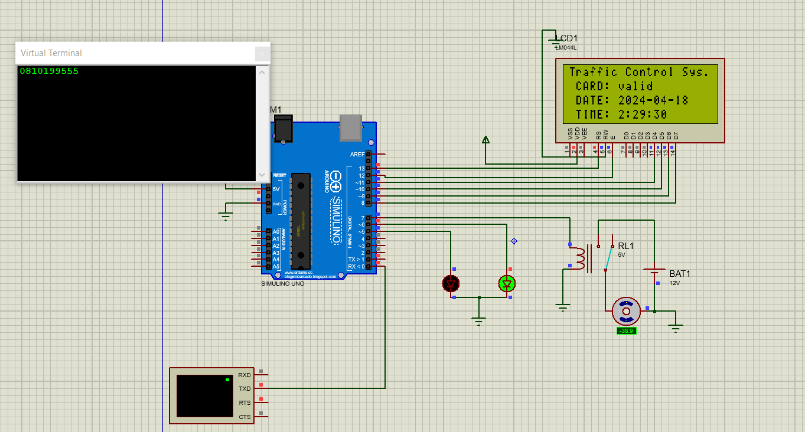
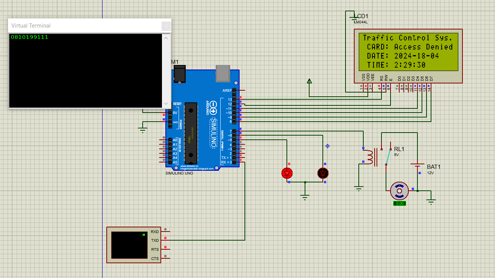
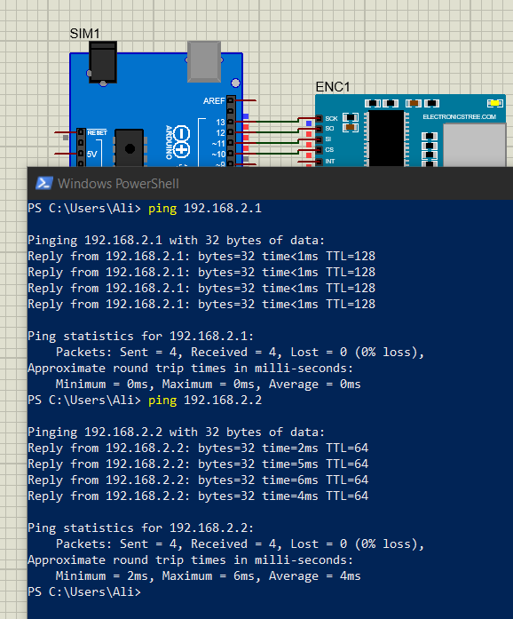
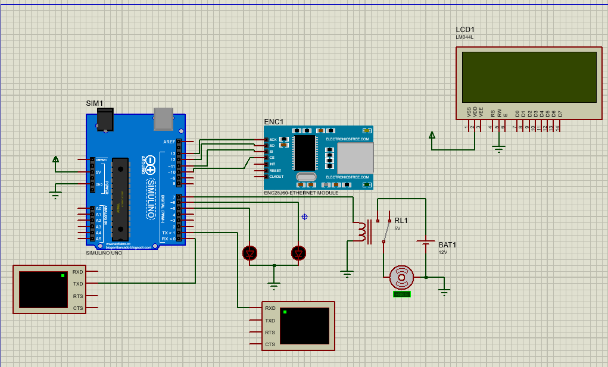

# CPS_IOT_HW
RFID door lock controlling Using ENC28J60 module 

## Report
**اعضای گروه:**
- <p  style="text-align:right;">حامد میر امیرخانی 810199</P>
  
- <p style="text-align:right;">محمد امین پورزارع 810199</p>
- <p style="text-align:right;">پارسا ناصری 810199</p>
- <p style="text-align:right;">علی عابدینی 810199555</p> 
## Server Side


## Embedded Side
ابتدا با فرض ماژول های wifi و یا ethernet شروع به ساخت مدار کردیم. نتایج در زیر قابل مشاهده است:
- <p style="text-align:right;">در صورتی که rfid معتبر باشد:</p>

- <p style="text-align:right;">در صورتی که rfid معتبر <b>نباشد</b>:</p>


---

سپس با پیروی از مراحل setup کردن ماژول اترنت (enc28j60)، توانستیم یک لوپ بک روی اترنت مجازی بر روی سیستم، پیاده سازی کنیم:



---

در نهایت با Reprogram کردن برد Arduino و اتصال ماژول اترنت، مدار نهایی به صورت زیر میباشد:



در ادامه مراحل program کردن برد Arduino آمده است:

## Client Part

در این پوشه کد برای سامانه‌ی مانیتورینگ GUI مبتنی بر Qt قرار دارد که برای نمایش رویدادهای ورود استفاده می‌شود. کد اصلی ابتدایی ارائه شده بوده و به طور قابل توجهی بهبودها و افزایش‌های معناداری برای سازگاری با نیازها و قابلیت‌های خاص پروژه‌ی ما صورت گرفته است.

#### `cpsapplication.h`

- **تعریف سیگنال و اسلات**: فایل هدر به‌روز شده است تا شامل سیگنال‌ها و اسلات‌های جدیدی باشد که ارتباط بین اجزا GUI و فرآیندهای پشتیبان را فراهم می‌کنند.

#### `cpsapplication.cpp`

تغییرات اساسی و ویژگی‌های جدیدی به `cpsapplication.cpp` اضافه شده است تا قابلیت و تجربه‌ی کاربری را بهبود ببخشد:

همچنین به‌روزرسانی‌ای در متد مسئول فعال یا غیرفعال کردن اجزای UI در کلاس `MainWindow` صورت گرفته است. این تغییر کارایی و واکنش‌پذیری رابط کاربری را بهبود می‌بخشد.

**صفحه نمایش:**

یک متد توسعه داده شده است تا داده‌های تاریخچه را از سرور دریافت و نمایش دهد. این متد داده‌های JSON را تجزیه کرده، جزئیات مورد نیاز را استخراج کرده و آنها را به پنجره تاریخچه برای نمایش منتقل می‌کند.

```cpp
void Application::showHistoryWindow(const QJsonObject &jsonObject)
{
    setWindowsThemeToDark<HistoryWindow>(*_history);

    QJsonArray historyArray = jsonObject["data"].toArray();

    QVariantList list;

    for (const QJsonValue &value : historyArray) {
        QJsonObject historyObject = value.toObject();
        QJsonObject obj;
        obj["username"] = historyObject["username"].toString();
        obj["date"] = historyObject["date"].toString();
        obj["time"] = historyObject["time"].toString();
        list.append(obj);
    }

    QJsonArray data = QJsonArray::fromVariantList(list);

    _history->show(data);
}
```


در بخش بعدی یعنی پیاده سازی سوکت مشتری جزئیات پیاده‌سازی کلاس `CPSSocket` که تمام ارتباطات TCP/IP بین برنامه‌ی مشتری و سرور را مدیریت می‌کند، ذکر شده است. این کلاس برای ارسال و دریافت داده از شبکه، احراز هویت مدیر و دریافت به‌روزرسانی‌ها درباره رویدادهای ورود و تاریخچه بسیار حیاتی است.

#### `cpssocket.h`
 از `QObject` به ارث برده شده و ارتباطات سوکت TCP را مدیریت می‌کند.


#### `cpssocket.cpp`
یک شیء جدید `CPSSocket` را مقداردهی اولیه کرده و یک `QTcpSocket` جدید ایجاد می‌کند.
دسترسی خارجی به سوکت TCP داخلی را فراهم می‌کند که اجازه می‌دهد سایر بخش‌های برنامه از سوکت برای وظایف شبکه مختلف استفاده کنند.

---

### Server part

این پوشه شامل تمام فایل‌های مورد نیاز برای راه‌اندازی و اجرای سرور است که ارتباط بین دستگاه‌های اینترنت اشیاء (برد‌های آردوینو) و برنامه‌های مشتری را مدیریت می‌کند. سرور برای پاسخگویی به درخواست‌ها از طریق HTTP از بردهای آردوینو برای احراز هویت RFID استفاده می‌کند و از طریق WebSocket با برنامه‌های مشتری ارتباط برقرار می‌کند.


#### `httpserver.cpp` و `httpserver.h`
این فایل‌ها تعریف و پیاده‌سازی یک سرور HTTP سفارشی که برای سیستم IoT ما طراحی شده است را تعیین می‌کنند.  HTTP را بررسی می‌کند.

**فایل `.h`:**
```cpp
#ifndef HTTPSERVER_H
#define HTTPSERVER_H

#include <QObject>
#include <QCoreApplication>
#include <QHttpServer>
#include <QHttpServerRequest>
#include <QHttpServerResponse>
#include <QJsonDocument>
#include <QJsonObject>
#include <QJsonDocument>
#include <QJsonObject>
#include "usersManager.h"

class HttpServer : public QObject
{
    Q_OBJECT
public:
    explicit HttpServer(int port, const QString &initialDataPath, QObject *parent = nullptr);

signals:
    void rfidMatch(bool isMatch, const QString &rfid);
    void rfidHistory(bool isMatch, const QString Date, const QString &currentTime, const QString &rfid);

private:
    QHttpServerResponse handleRequest(const QHttpServerRequest &request);
    QHttpServer* httpServer_;
    UsersManager usersManger;
};

#endif // HTTPSERVER_H

```
**فایل `.cpp`:**

```cpp
#include "httpServer.h"

HttpServer::HttpServer(int port, const QString &initialDataPath, QObject *parent) :
    QObject(parent), usersManger(UsersManager(initialDataPath)), httpServer_(new QHttpServer())
{
    httpServer_->route("/rfid",QHttpServerRequest::Method::Post, [this](const QHttpServerRequest& request) {
        return this->handleRequest(request);
    });

    httpServer_->listen(QHostAddress::Any, port);
}

QHttpServerResponse HttpServer::handleRequest(const QHttpServerRequest& request)
{
    QByteArray requestData = request.body();
    QString rfid = requestData;

    QDateTime currentDateTime = QDateTime::currentDateTime();

    QDate currentDate = currentDateTime.date();
    QTime currentTime = currentDateTime.time();

    QString dateString = currentDate.toString("yyyy-MM-dd");
    QString timeString = currentTime.toString("HH:mm:ss");

    bool isAuthorized = usersManger.handleRfidReceived(rfid);

    emit rfidMatch(isAuthorized, rfid);
    emit rfidHistory(isAuthorized, dateString, timeString, rfid);

    QByteArray result = isAuthorized ? "1" : "0";
    QHttpServerResponse::StatusCode statusCode =
        isAuthorized ?
        QHttpServerResponse::StatusCode::Ok :
        QHttpServerResponse::StatusCode::Unauthorized;

    return QHttpServerResponse(result, statusCode);
}
```
در فایل .h، کلاس HttpServer تعریف شده است که از QObject ارث‌بری می‌کند. این کلاس برای پیاده‌سازی یک سرور HTTP برای ارتباط با مشتری‌ها مورد استفاده قرار می‌گیرد. این کلاس دارای سیگنال‌های rfidMatch و rfidHistory است که وضعیت match شدن برچسب RFID  را اعلام می‌کنند.

در فایل .cpp، در سازنده کلاس HttpServer، سرور HTTP تنظیم و به listen کردن در مسیر /rfid روی پورت مشخص شده قرار می‌گیرد. در متد handleRequest، درخواست‌های HTTP دریافت شده و بررسی می‌شود. سپس بر اساس matchشدن  برچسب RFID با دیتابیس کاربران، پاسخ مناسب تولید می‌شود و سیگنال‌های rfidMatch و rfidHistory فرستاده می‌شوند.

#### `user.cpp` و `user.h`  
این فایل‌ها کلاس `User` را تعریف و پیاده‌سازی می‌کنند که مسئول پکت کردن داده‌های مربوط به کارمندان در سیستم است.

**فایل `.h`:**  
```cpp
#ifndef USER_H
#define USER_H

#include <QJsonObject>
#include <QJsonDocument>

class User
{
public:
    User();
    User(const QString &rfidTag);
    bool checkRFIDTagMatched(const QString &rfidTag) const;
private:
    QString rfidTag_;
};

#endif // USER_H

```
**فایل `.cpp`:**

```cpp
#include "user.h"

User::User() {
    rfidTag_ = nullptr;
}

User::User(const QString &rfidTag) : rfidTag_(rfidTag) {};

bool User::checkRFIDTagMatched(const QString &rfidTag) const{
    return rfidTag_ == rfidTag;
}

```
در فایل `.h`، کلاس `User` تعریف شده است که وظیفه‌ی آن مدیریت اطلاعات کاربران در سیستم است. این کلاس شامل متد `checkRFIDTagMatched` است که برای بررسی تطابق برچسب RFID کاربر با برچسب دریافتی استفاده می‌شود.

در فایل `.cpp`، در  متد `checkRFIDTagMatched`، عملکرد اصلی کلاس `User` توضیح داده شده است. کلاس `User` با مقایسه برچسب RFID کاربر با دریافتی، تطابق را بررسی می‌کند و نتیجه را به عنوان یک مقدار بولین بازمی‌گرداند.


#### `userManager.cpp` و `userManager.h`  
این فایل‌ها شامل کلاس `UserManager` هستند. کلاس `UserManager` مدیریت مجموعه‌ای از کاربران را بر عهده دارد، به خصوص لیبل های RFID آن‌ها را برای تسهیل کنترل دسترسی در سیستم فراهم می‌کند. این کلاس فایل JSON در زمان شروع بارگذاری می‌کند و متد‌هایی برای تأیید برچسب‌های RFID در مقابل این داده فراهم می‌کند.

**فایل `.h`:**  
```cpp
#ifndef USERSMANAGER_H
#define USERSMANAGER_H

#include <QObject>
#include <QVector>
#include "user.h"

class UsersManager : public QObject
{
    Q_OBJECT
public:
    explicit UsersManager(const QString &initialDataPath, QObject *parent = nullptr);

    const QVector<User>& getUsersList() const;
    bool handleRfidReceived(const QString &rfid);

private:
    QVector<User> usersList;
    void readUsersFromFile(const QString &path);
    void parseJsonData(const QByteArray &jsonData, const QString &path);
};

#endif // USERSMANAGER_H

```
**فایل `.cpp`:**

```cpp
#include "usersManager.h"
#include <QFile>
#include <QJsonArray>
#include <QJsonDocument>
#include <QJsonObject>

UsersManager::UsersManager(const QString &path, QObject *parent) : QObject(parent)
{
    readUsersFromFile(path);
}

void UsersManager::readUsersFromFile(const QString &path)
{
    QFile file(path);
    if (!file.open(QIODevice::ReadOnly | QIODevice::Text)) {
        qDebug() << "Failed to open " + path;
        return;
    }

    QByteArray jsonData = file.readAll();
    file.close();

    parseJsonData(jsonData, path);
}

void UsersManager::parseJsonData(const QByteArray &jsonData, const QString &path)
{
    QJsonDocument doc = QJsonDocument::fromJson(jsonData);
    if (!doc.isArray()) {
        qDebug() << "Invalid JSON format in " + path;
        return;
    }
    QJsonArray usersArray = doc.array();
    for (const QJsonValue& userValue : usersArray) {
        if (!userValue.isObject()) {
            qDebug() << "Invalid user data in " + path;
            continue;
        }
        QJsonObject userObject = userValue.toObject();
        QString rfidTag = userObject["rfid"].toString();

        User user(rfidTag);
        usersList.append(user);
    }
}

const QVector<User>& UsersManager::getUsersList() const
{
    return usersList;
}

bool UsersManager::handleRfidReceived(const QString &rfid) {
    bool isMatch = false;
    for (const User &user : usersList) {
        if (user.checkRFIDTagMatched(rfid)) {
            isMatch = true;
            break;
        }
    }

    return isMatch;
}

```
در فایل `.h`، کلاس `UsersManager` تعریف شده است که مسئول مدیریت کاربران در سیستم است. این کلاس شامل متدهای `getUsersList` و `handleRfidReceived` است.

- `getUsersList`: این متد برای بازگرداندن لیست کاربران استفاده می‌شود. لیستی از اشیاء `User` را که در کلاس `UsersManager` ذخیره شده‌اند، بازمی‌گرداند.

- `handleRfidReceived`: این متد برای بررسی تطابق برچسب RFID دریافتی با برچسب‌های موجود در لیست کاربران استفاده می‌شود. اگر تطابقی پیدا شود، مقدار `true` بازمی‌گرداند؛ در غیر این صورت، `false` بازمی‌گرداند.

در فایل `.cpp`، دو متد `readUsersFromFile` و `parseJsonData` تعریف شده‌اند که به ترتیب فایل JSON حاوی اطلاعات کاربران را می‌خوانند و اطلاعات را از آن استخراج می‌کنند. سپس، اشیاء `User` از اطلاعات استخراج شده ایجاد می‌شوند و به لیست کاربران اضافه می‌شوند.

همچنین، سازنده کلاس `UsersManager` پیاده‌سازی شده است که در آن فایل JSON مورد نیاز برای مدیریت کاربران بارگذاری می‌شود و سپس داده‌های موجود در آن پردازش می‌شوند.


#### `logger.cpp` و `logger.h`
در فایل .h، کلاس Logger تعریف شده است که مسئول ثبت و نگهداری تاریخچه ورود کاربران به سیستم است. این کلاس شامل ساختار داده LoggedInUserHistory و متدهای getLoginHistories، handleRequestLoginHistory و addLoginHistory است.

**فایل `.h`:**  
```cpp
#ifndef LOGGER_H
#define LOGGER_H

#include <QObject>
#include <QVector>
#include <QString>

class Logger : public QObject
{
    Q_OBJECT

public:
    struct LoggedInUserHistory{
        QString username;
        QString date;
        QString time;
        bool permitted;
    };
    explicit Logger(const QString& initialDataPath, QObject* parent = nullptr);

    const QVector<Logger::LoggedInUserHistory>& getLoginHistories() const;

signals:
    void loggedInUsersUpdated(const QVector<Logger::LoggedInUserHistory>& history); // Changed signal name to follow naming convention

public slots:
    void handleRequestLoginHistory();
    void addLoginHistory(bool isMatch, const QString& date, const QString& currentTime, const QString& rfid);

private:
    QVector<LoggedInUserHistory> loggedInUserInfo;
    void readLoginHistoriesFromJson(const QString& path);
    void parseJsonData(const QByteArray& jsonData);
    void parseLoggedInUser(const QJsonObject& loggedInUserObj);
};

#endif // LOGGER_H


```
**فایل `.c`:**  
```cpp
#include "logger.h"

#include <QFile>
#include <QJsonArray>
#include <QJsonDocument>
#include <QJsonObject>

Logger::Logger(const QString& initialDataPath, QObject* parent)
    : QObject(parent)
{
    readLoginHistoriesFromJson(initialDataPath);
}

const QVector<Logger::LoggedInUserHistory>& Logger::getLoginHistories() const
{
    return loggedInUserInfo;
}

void Logger::readLoginHistoriesFromJson(const QString& path)
{
    QFile file(path);
    if (!file.open(QIODevice::ReadOnly | QIODevice::Text)) {
        qWarning("Failed to open %s", qPrintable(path));
        return;
    }
    QByteArray jsonData = file.readAll();
    file.close();

    parseJsonData(jsonData);
}

void Logger::parseJsonData(const QByteArray& jsonData)
{
    QJsonParseError error;
    QJsonDocument doc = QJsonDocument::fromJson(jsonData, &error);
    if (error.error != QJsonParseError::NoError) {
        qWarning("Invalid JSON format: %s", qPrintable(error.errorString()));
        return;
    }
    if (!doc.isArray()) {
        qWarning("Root of JSON file is not an array");
        return;
    }
    loggedInUserInfo.clear();
    const QJsonArray infoArray = doc.array();
    for (const QJsonValue& val : infoArray) {
        if (!val.isObject()) {
            qWarning("Invalid login history data");
            continue;
        }
        parseLoggedInUser(val.toObject());
    }
}

void Logger::parseLoggedInUser(const QJsonObject& loggedInUserObj)
{
    LoggedInUserHistory entry;
    entry.username = loggedInUserObj["username"].toString();
    entry.date = loggedInUserObj["date"].toString();
    entry.time = loggedInUserObj["time"].toString();
    entry.permitted = loggedInUserObj["permited_"].toBool();
    loggedInUserInfo.append(entry);
}

void Logger::handleRequestLoginHistory()
{
    emit loggedInUsersUpdated(loggedInUserInfo);
}

void Logger::addLoginHistory(bool isMatch, const QString& date, const QString& currentTime, const QString& rfid)
{
    LoggedInUserHistory newEntry = {rfid, date, currentTime, isMatch};
    loggedInUserInfo.append(newEntry);
    qInfo("New history: %ls %ls %d", qUtf16Printable(newEntry.username), qUtf16Printable(newEntry.time), newEntry.permitted);
}

```
- `LoggedInUserHistory`: این ساختار داده شامل اطلاعاتی مانند نام کاربر، تاریخ ورود، زمان ورود و مجوز ورود (به عنوان مثال `true` برای مجاز و `false` برای غیرمجاز) است.

- `getLoginHistories`: این متد برای بازگرداندن تاریخچه ورود کاربران استفاده می‌شود. لیستی از اشیاء `LoggedInUserHistory` که در کلاس `Logger` ذخیره شده‌اند، بازمی‌گرداند.

- `handleRequestLoginHistory`: این اسلات برای درخواست ارسال تاریخچه ورود کاربران استفاده می‌شود. هنگام فراخوانی، این اسلات `loggedInUsersUpdated` را فعال می‌کند و تاریخچه ورود را ارسال می‌کند.

- `addLoginHistory`: این اسلات برای افزودن یک ورود جدید به تاریخچه استفاده می‌شود. ورود جدید با اطلاعات مربوط به نام کاربر، تاریخ و زمان ورود، وضعیت مجوز ورود (مجاز یا غیرمجاز) وارد تاریخچه می‌شود.

در فایل `.cpp`، متدهای `readLoginHistoriesFromJson`، `parseJsonData` و `parseLoggedInUser` تعریف شده‌اند که به ترتیب اطلاعات تاریخچه ورود کاربران از یک فایل JSON را می‌خوانند، اطلاعات را پردازش می‌کنند و به لیست تاریخچه اضافه می‌کنند. همچنین، سازنده و سایر متدها برای مدیریت تاریخچه و ارسال آن به درخواست‌کننده پیاده‌سازی شده‌اند.


#### `webSocketServer.cpp` و `webSocketServer.h`
فایل های `webSocketServer.cpp` و `webSocketServer.h` کلاس `WebSocketServer` را تعریف و پیاده‌سازی می‌کنند که یک سرور WebSocket برای برقراری ارتباط با کلاینت‌ها است. این کلاس شامل متدهای مختلفی برای پردازش درخواست‌ها و ارسال پاسخ‌ها به کلاینت‌ها است.

**فایل `.h`:**  
```cpp
#ifndef WEBSOCKETSERVER_H
#define WEBSOCKETSERVER_H

#include "logger.h"

#include <QTcpServer>
#include <QTcpSocket>
#include <QDebug>
#include <QJsonDocument>
#include <QJsonArray>
#include <QJsonObject>
#include <QDateTime>

class WebSocketServer : public QTcpServer {
    Q_OBJECT

public:
    WebSocketServer(QObject *parent = nullptr);

protected:
    void incomingConnection(qintptr socketDescriptor) override;
    bool isValidRFID(const QString &rfid);
    void processData(QByteArray &data, QTcpSocket *clientSocket);
    bool isValidUser(const QString &username, const QString &password);
    QByteArray retrieveHistoryData();
    void matchUser(const QByteArray &data, QTcpSocket *clientSocket);

signals:
    void requestLoginHistory();

public slots:
    void sendNewUserDataToAdmin(bool isMatch, const QString &rfid);
    void sendJsonDataToAdmin(const QByteArray &jsonData);
    QByteArray convertJsonDocument(const QJsonObject &jsonObject);
    QJsonObject createMessageObject(const QString &rfid, const QString &dateString, const QString &timeString);
    void createDateTimeStrings(QString &dateString, QString &timeString);

    void sendLoginHistoryResult(const QVector<Logger::LoggedInUserHistory> &loginHistories);
    QJsonObject createJsonObject(const QVector<Logger::LoggedInUserHistory> &loginHistories);
    void sendJsonData(const QByteArray &jsonData);

private:
    QStringList hardcodedRFIDs;
    QTcpSocket* clientSocketpointer; // Store pointer to client socket
};

#endif // WEBSOCKETSERVER_H
```


**فایل `.c`:**  
```cpp
#include "webSocketServer.h"

WebSocketServer::WebSocketServer(QObject *parent) : QTcpServer(parent) {
    hardcodedRFIDs << "RFID1" << "RFID2" << "RFID3";
}

void WebSocketServer::incomingConnection(qintptr socketDescriptor) {
    QTcpSocket *clientSocket = new QTcpSocket(this);
    if (!clientSocket->setSocketDescriptor(socketDescriptor)) {
        qDebug() << "Error setting socket descriptor";
        return;
    }

    qDebug() << "New connection from:" << clientSocket->peerAddress().toString();

    connect(clientSocket, &QTcpSocket::readyRead, this, [this, clientSocket]() {

        QByteArray data = clientSocket->readAll();
        qDebug() << "Received:" << data;
        processData(data, clientSocket);
        clientSocketpointer = clientSocket;

    });

    connect(clientSocket, &QTcpSocket::disconnected, this, [clientSocket]() {
        qDebug() << "Connection closed for:" << clientSocket->peerAddress().toString();
        clientSocket->deleteLater();
    });
}

bool WebSocketServer::isValidRFID(const QString &rfid) {
    return hardcodedRFIDs.contains(rfid);
}

void WebSocketServer::processData(QByteArray &data, QTcpSocket *clientSocket) {
    qDebug() << "in  SocketServer::processData";
    if(data == "historyRequest"){
        qDebug() << "i am still in historyRequest.";
        emit requestLoginHistory();
        qDebug() << "i have sent message in historyRequest.";
    }
    else{
        matchUser(data, clientSocket);
    }
}

void WebSocketServer::matchUser(const QByteArray &data, QTcpSocket *clientSocket){
    QList<QByteArray> parts = data.split(':');

    if (parts.size() >= 2) {
        QString username = QString::fromUtf8(parts[0]);
        QString password = QString::fromUtf8(parts[1]);
        bool isMatch = isValidUser(username, password);
        if (isMatch) {
            clientSocket->write("1");
        } else {
            clientSocket->write("0");
            clientSocket->close();
        }
        qDebug() << "username: " << username << ", password: " << password;
    } else {
        qDebug() << "Encountered an error setting the socket descriptor.";
    }
}

bool WebSocketServer::isValidUser(const QString &username, const QString &password) {
    return (username == "ali" && password == "1111");
}

void WebSocketServer::sendNewUserDataToAdmin(bool isMatch, const QString &rfid) {
    QString dateString, timeString;
    createDateTimeStrings(dateString, timeString);

    QJsonObject messageObj = createMessageObject(rfid, dateString, timeString);
    if (!messageObj.isEmpty()) {
        QByteArray jsonData = convertJsonDocument(messageObj);
        sendJsonDataToAdmin(jsonData);
    }
}

void WebSocketServer::createDateTimeStrings(QString &dateString, QString &timeString) {
    QDateTime currentDateTime = QDateTime::currentDateTime();
    QDate currentDate = currentDateTime.date();
    QTime currentTime = currentDateTime.time();
    dateString = currentDate.toString("yyyy-MM-dd");
    timeString = currentTime.toString("HH:mm:ss");
}

QJsonObject WebSocketServer::createMessageObject(const QString &rfid, const QString &dateString, const QString &timeString) {
    QJsonObject messageObj;
    messageObj["type"] = "user";
    messageObj["username"] = rfid;
    messageObj["date"] = dateString;
    messageObj["time"] = timeString;
    return messageObj;
}

void WebSocketServer::sendJsonDataToAdmin(const QByteArray &jsonData) {
    qint64 bytesWritten = clientSocketpointer->write(jsonData);
    if (bytesWritten == -1) {
        qDebug() << "Failed to write data to socket:" << clientSocketpointer->errorString();
    } else {
        qDebug() << "WebSocket message sent to client:" << jsonData;
    }
}

void WebSocketServer::sendLoginHistoryResult(const QVector<Logger::LoggedInUserHistory> &loginHistories){
    if (this->clientSocketpointer) {
        QJsonObject mainObj = createJsonObject(loginHistories);
        if (!mainObj.isEmpty()) {
            QByteArray jsonData = convertJsonDocument(mainObj);
            sendJsonData(jsonData);
        }
    }
}

QJsonObject WebSocketServer::createJsonObject(const QVector<Logger::LoggedInUserHistory> &loginHistories) {
    QJsonArray dataArray;
    for (const Logger::LoggedInUserHistory &entry : loginHistories) {
        QJsonObject obj;
        obj["username"] = entry.username;
        obj["date"] = entry.date;
        obj["time"] = entry.time;
        obj["permitted"] = entry.permitted;
        dataArray.append(obj);
    }
    QJsonObject mainObj;
    mainObj["type"] = "history";
    mainObj["data"] = dataArray;
    return mainObj;
}

QByteArray WebSocketServer::convertJsonDocument(const QJsonObject &jsonObject) {
    QJsonDocument jsonDocument(jsonObject);
    return jsonDocument.toJson();
}

void WebSocketServer::sendJsonData(const QByteArray &jsonData) {
    clientSocketpointer->write(jsonData);
}


```

- `WebSocketServer::WebSocketServer`: سازنده کلاس `WebSocketServer` است که مقادیر پیش‌فرض را مقداردهی اولیه می‌کند.

- `WebSocketServer::incomingConnection`: این متد برای پردازش درخواست‌های ورودی از کلاینت‌ها استفاده می‌شود. هنگامی که یک اتصال جدید برقرار می‌شود، این متد فراخوانی می‌شود و یک `QTcpSocket` برای کلاینت جدید ایجاد می‌شود. سپس ارتباط با این کلاینت برای دریافت داده‌های جدید تنظیم می‌شود.

- `WebSocketServer::isValidRFID`: این متد برای بررسی اعتبار RFID استفاده می‌شود.

- `WebSocketServer::processData`: این متد برای پردازش داده‌های دریافتی از کلاینت‌ها استفاده می‌شود. در اینجا، داده‌ها بررسی می‌شوند و بر اساس نوع آن‌ها، اقدامات مختلفی انجام می‌شود.

- `WebSocketServer::matchUser`: این متد برای اعتبارسنجی ورود کاربران استفاده می‌شود.

- `WebSocketServer::sendNewUserDataToAdmin`: این متد برای ارسال داده‌های جدید کاربر به ادمین استفاده می‌شود.

- `WebSocketServer::createDateTimeStrings`: این متد برای ایجاد رشته‌های تاریخ و زمان استفاده می‌شود.

- `WebSocketServer::createMessageObject`: این متد برای ایجاد شیء پیام استفاده می‌شود.

- `WebSocketServer::sendJsonDataToAdmin`: این متد برای ارسال داده‌های JSON به ادمین استفاده می‌شود.

- `WebSocketServer::sendLoginHistoryResult`: این متد برای ارسال نتایج تاریخچه ورود به کلاینت استفاده می‌شود.

- `WebSocketServer::createJsonObject`: این متد برای ایجاد شیء JSON استفاده می‌شود.

- `WebSocketServer::convertJsonDocument`: این متد برای تبدیل یک شیء JSON به یک آرایه بایت JSON استفاده می‌شود.

- `WebSocketServer::sendJsonData`: این متد برای ارسال داده‌های JSON به کلاینت استفاده می‌شود.

---

### Database Folder
شامل فایل های json هستند که داده های اولیه را برای پروژه تعیین میکنند.
1. `admins.json`:
   -  اطلاعات ادمین ها را که برای مدیریت سیستم لازم است، ذخیره می‌کند.

2. `users.json`:
   -  شامل سوابق کاربران است که کلاس `userManager` وظیفه ی مدیریت کردن آن را دارد.

3. `logger.json`:
   -  ورود و تاریخچه دسترسی user ها را ثبت می‌کند.

---

#### Test web server part with postman 
در اینجا، سرور با موفقیت یک تگ RFID مجاز را تشخیص می‌دهد و یک وضعیت `200 OK`  را برمی‌گرداند که نشان می‌دهد درخواست مجاز است. عدد ۱ نشان دهند موفقیت آمیز بودن آن و ۰ نشان دهنده دسترسی غیر مجاز است.


که اگر به فایل users.json توجه کنید متوجه مچ شدن آن با rfid نفر اول میشوید:


---

#### Test result


